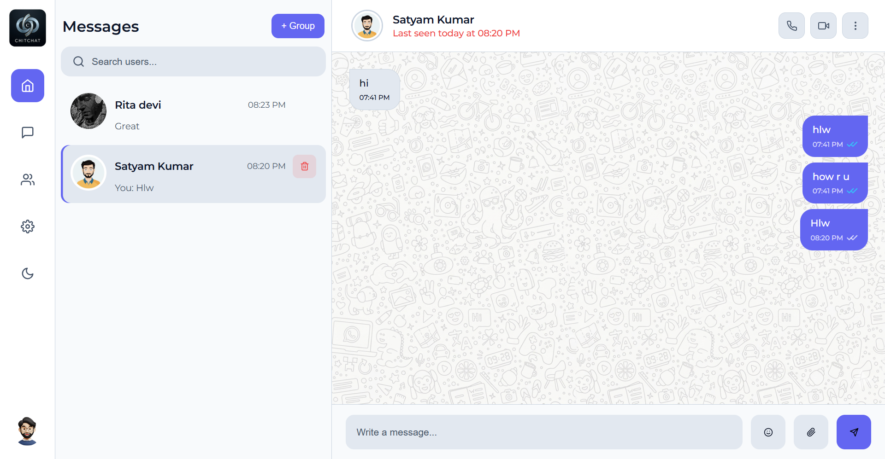
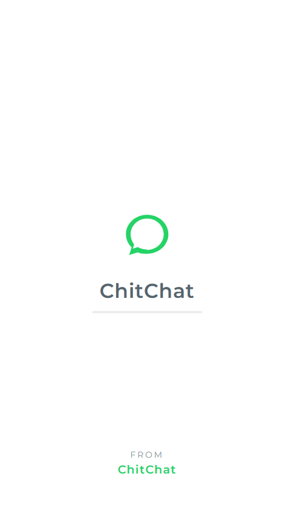
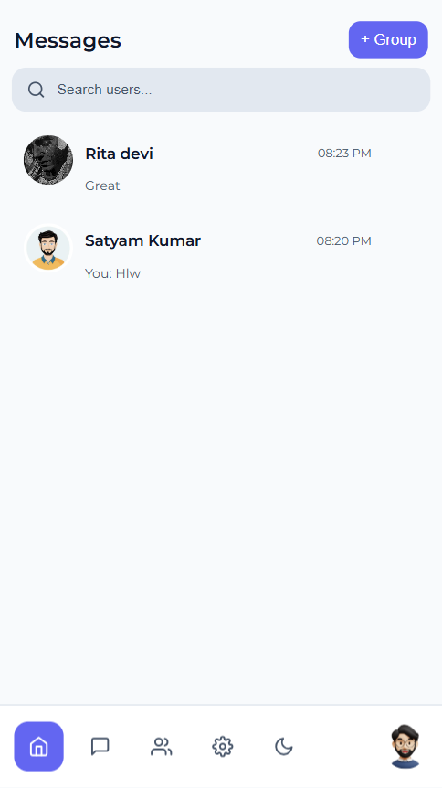
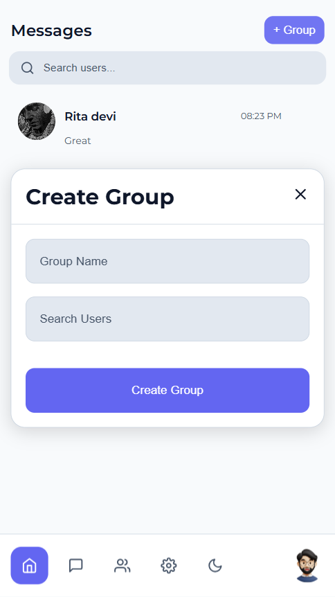
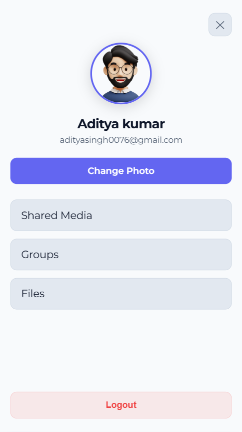
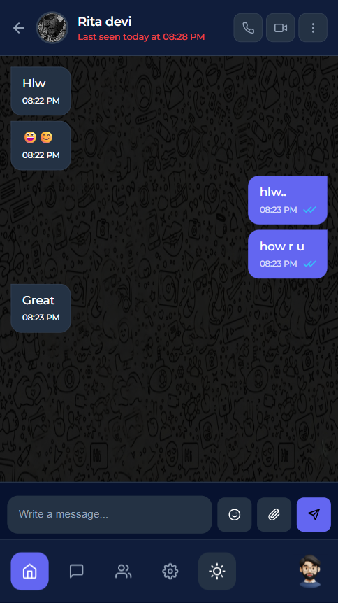
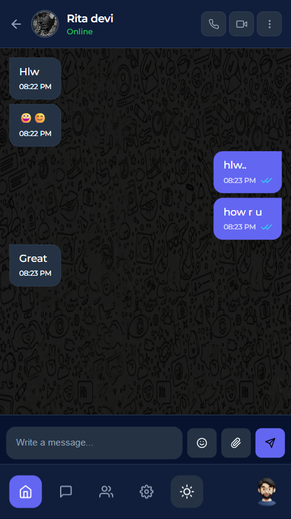

# ChitChat — Real-Time Chat Application

A responsive full-stack chat application with real-time private and group messaging, online presence, typing indicators, unread counts, and seen receipts.

## Live Demo

- **Application:** https://chitchat007.netlify.app
- **Backend Health Check:** https://chat-app-backend-txji.onrender.com/api/health
- **Frontend Repository:** https://github.com/Aditya7j/chat-app
- **Backend Repository:** https://github.com/Aditya7j/Chat-App-Backend

> The backend runs on Render's free tier. If it has been inactive, the first request may take a few seconds while the service wakes up.

## Preview

### Desktop Chat



### Mobile Experience

<p align="center">
  
  
  
</p>

<p align="center">
  
  
  
</p>

## Features

- JWT-based user registration and login
- Real-time one-to-one messaging with Socket.IO
- Real-time group conversations
- Group creation and member information
- Online and offline user presence
- Last-seen information
- Typing indicators
- Seen messages with blue double ticks
- Unread-message counters
- Message previews and latest-chat ordering
- Profile avatar upload
- Chat deletion
- Light and dark themes
- Responsive desktop and mobile layouts
- React Router support with Netlify SPA redirects

## Technology Stack

### Frontend

- React
- React Router
- Context API
- Axios
- Socket.IO Client
- React Icons
- React Hot Toast
- Emoji Picker React
- React Loader Spinner
- CSS

### Backend

- Node.js
- Express
- MongoDB Atlas
- Mongoose
- Socket.IO
- JSON Web Tokens
- bcryptjs
- Multer

### Deployment

- **Frontend:** Netlify
- **Backend:** Render
- **Database:** MongoDB Atlas

## Local Development

### Prerequisites

- Node.js
- npm
- A MongoDB Atlas account

### 1. Clone the repositories

```bash
git clone https://github.com/Aditya7j/chat-app.git
git clone https://github.com/Aditya7j/Chat-App-Backend.git
```

### 2. Start the backend

```bash
cd Chat-App-Backend
npm install
```

Create a `.env` file in the backend root:

```env
PORT=5000
MONGO_URI=your_mongodb_atlas_connection_string
JWT_SECRET=your_jwt_secret
CLIENT_URL=http://localhost:3000
NODE_ENV=development
```

Run the backend:

```bash
npm run dev
```

The backend will be available at:

```text
http://localhost:5000
```

### 3. Start the frontend

Open another terminal:

```bash
cd chat-app
npm install
```

Create a `.env` file in the frontend root:

```env
REACT_APP_API_URL=http://localhost:5000/api
REACT_APP_SOCKET_URL=http://localhost:5000
```

Run the frontend:

```bash
npm start
```

The application will be available at:

```text
http://localhost:3000
```

## Production Environment Variables

### Netlify

```env
REACT_APP_API_URL=https://chat-app-backend-txji.onrender.com/api
REACT_APP_SOCKET_URL=https://chat-app-backend-txji.onrender.com
```

### Render

```env
MONGO_URI=your_mongodb_atlas_connection_string
JWT_SECRET=your_jwt_secret
NODE_ENV=production
CLIENT_URL=https://chitchat007.netlify.app
```

## Real-Time Events

Socket.IO handles:

- User connection and online presence
- New messages
- Typing and stop-typing events
- Read-receipt updates
- Unread-message synchronization

## Deployment Notes

The frontend includes the following Netlify redirect rule in `public/_redirects`:

```text
/* /index.html 200
```

This allows React Router routes to work correctly after a browser refresh.

## Author

**Aditya Kumar**

- GitHub: https://github.com/Aditya7j
- Live Project: https://chitchat007.netlify.app
